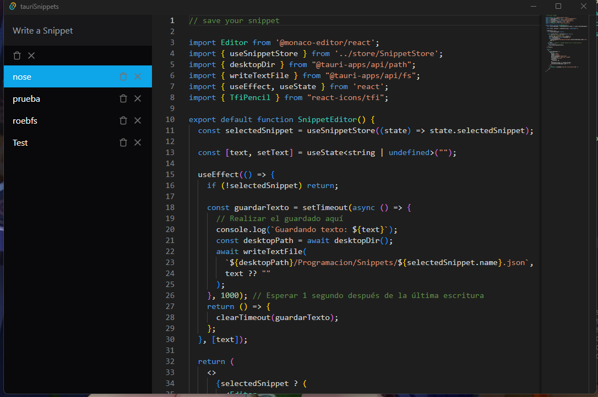

# Tauri + React + Typescript

This template should help get you started developing with Tauri, React and Typescript in Vite.

## Recommended IDE Setup

- [VS Code](https://code.visualstudio.com/) + [Tauri](https://marketplace.visualstudio.com/items?itemName=tauri-apps.tauri-vscode) + [rust-analyzer](https://marketplace.visualstudio.com/items?itemName=rust-lang.rust-analyzer)

## 🔗 Summary 🔗

The Snippets App is a user-friendly tool that helps developers manage and organize their code snippets effectively. It offers features such as creating, editing, and categorizing snippets based on tags or custom categories. The app's search functionality enables quick access to specific code snippets, and it also allows for snippet sharing and collaboration with teammates. With code highlighting and formatting options, along with the ability to add comments or annotations, the app enhances code readability and understanding. Additionally, it integrates seamlessly with popular text editors and IDEs, facilitating the import and export of snippets. Overall, the Snippets App simplifies coding tasks by providing a centralized repository for code snippets, promoting efficiency and collaboration among developers.



Features:

- ✅ Code organization
- ✅ Quick search
- ✅ Code editing
- ✅ Sharing and collaboration

## 👻 Project Structure

```
├── src
├── main
│   ├── components
│   ├── store
│   ├── app.tsx
│   └── vite-env
├── src-tauri
│   ├── icons
│   ├── target
│   └── tauri.conf.json
└── vite.config.ts
```
### requirements for it to work

```
• have rust installed
• Microsoft Visual Studio C++ Build Tools
• WebView2

 Note 
 all this is in the tauri documentation

```

## ⚗️ Commands

commands to start the snippets app

| Command            | Action                       |
| :------------------| :----------------------------|
| `npm install`      | to install node dependencies |
| `npm run tauri dev`|for the application to start  |

## Author

Roberth Zambrano ([@☆*: .｡. o(≧▽≦)o .｡.:*☆](https://github.com/juniorDeveloper8/juniorDeveloper8))
